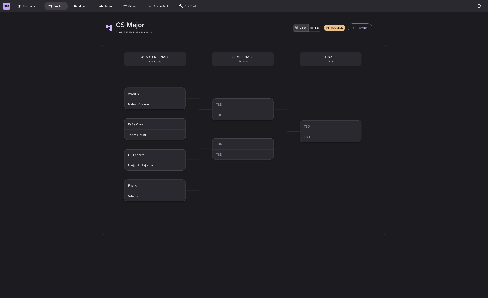

<div align="center">
  
  
  # MatchZy Auto Tournament
  
  ⚡ **Automated CS2 tournament management — one click from bracket creation to final scores**
  
  <p>Complete tournament automation for Counter-Strike 2 using the MatchZy plugin. Zero manual server configuration.</p>

[](LICENSE)
[](docker-compose.yml)
[](https://www.typescriptlang.org/)

**📚 <a href="https://mat.sivert.io/" target="_blank">Full Documentation</a>** • <a href="https://mat.sivert.io/getting-started/quick-start/" target="_blank">Quick Start</a> • <a href="https://mat.sivert.io/features/overview/" target="_blank">Features</a> • <a href="https://mat.sivert.io/roadmap/" target="_blank">Roadmap</a> • <a href="https://mat.sivert.io/guides/troubleshooting/" target="_blank">Troubleshooting</a>

</div>

---

## ✨ Features

🏆 **Tournament Brackets** — Single/Double Elimination, Round Robin, Swiss with auto-progression  
🧩 **Custom Bracket Viewer** — Bundled fork of `brackets-viewer.js` with enhanced theming, matchup centering, and MatchZy integration  
🗺️ **Interactive Map Veto** — FaceIT-style ban/pick system for BO1/BO3/BO5  
⚡ **Real-Time Updates** — WebSocket-powered live scores and player tracking  
🎮 **Auto Server Allocation** — Matches load automatically when servers are available  
👥 **Public Team Pages** — No-auth pages for teams to monitor matches and veto  
🎛️ **Admin Match Controls** — Pause, restore, broadcast, add players via RCON  
📊 **Player Tracking** — Live connection and ready status for all 10 players  
🎬 **Demo Management** — Automatic upload and download with streaming

<div align="center">
  
  <p><em>Double-elimination bracket with synchronized winner and loser paths plus interactive match zoom</em></p>
</div>

**👉 <a href="https://mat.sivert.io/screenshots/" target="_blank">View More Screenshots</a>**

---

## 🚀 Quick Start

> **⚠️ Prerequisites:** Requires a [custom MatchZy plugin](#️-cs2-server-plugin) — <a href="https://mat.sivert.io/getting-started/quick-start/#cs2-server-setup" target="_blank">Installation guide</a>

```bash
git clone https://github.com/sivert-io/matchzy-auto-tournament.git
cd matchzy-auto-tournament

# 1. Create environment file
cp .env.example .env

# 2. Generate secure tokens
openssl rand -hex 32  # Copy for API_TOKEN
openssl rand -hex 32  # Copy for SERVER_TOKEN

# 3. Edit .env and add:
#    - API_TOKEN (admin login)
#    - SERVER_TOKEN (CS2 server auth)
#    - WEBHOOK_URL (your server IP where CS2 sends events)
nano .env

# 4. Start everything
docker compose -f docker/docker-compose.yml up -d

# OR build locally (until first release)
# docker compose -f docker/docker-compose.dev.yml up -d --build
```

**Access at:** `http://localhost:3069`

<details>
<summary><b>Or use Docker Compose</b></summary>

Create `docker-compose.yml`:

```yaml
version: '3.8'

services:
  matchzy-tournament:
    image: sivertio/matchzy-auto-tournament:latest
    container_name: matchzy-tournament
    restart: unless-stopped
    ports:
      - '3069:3069'
    environment:
      - API_TOKEN=${API_TOKEN}
      - SERVER_TOKEN=${SERVER_TOKEN}
      - WEBHOOK_URL=http://your-ip:3069/api
    volumes:
      - ./data:/app/data
```

Run: `docker compose up -d`

</details>

**👉 <a href="https://mat.sivert.io/getting-started/quick-start/" target="_blank">Full setup guide with detailed configuration</a>**

---

## 🧩 Bracket Viewer Fork

The frontend bundles a lightly modified copy of [`brackets-viewer.js`](https://github.com/Drarig29/brackets-viewer.js) inside `client/src/brackets-viewer`. Our fork adds:

- Material UI theming hooks and dark-mode variables
- Automatic seeding + match positioning interop with MatchZy data
- Smooth zoom-to-match navigation for the bracket modal workflow

When upgrading to a newer upstream release, follow the notes in the [development docs](https://mat.sivert.io/development/architecture/#frontend-bracket-viewer) to re-apply local patches.

---

## ⚙️ CS2 Server Plugin

> [!CAUTION]
> This project requires a **modified version of MatchZy** with enhanced event tracking.
>
> The official MatchZy release does not expose all the granular match and player events required for full automation.

**Download:** <a href="https://github.com/sivert-io/matchzy/releases" target="_blank">sivert-io/matchzy/releases</a>

Extract to your CS2 server's `csgo/` directory and restart.

**👉 <a href="https://mat.sivert.io/getting-started/quick-start/#cs2-server-setup" target="_blank">Complete installation guide</a>**

Requires <a href="https://docs.cssharp.dev/guides/getting-started/" target="_blank">CounterStrikeSharp</a> to be installed first.

---

## 🤝 Contributing

Contributions are welcome! Whether you're fixing bugs, adding features, improving docs, or sharing ideas.

**👉 <a href=".github/CONTRIBUTING.md" target="_blank">Read the Contributing Guide</a>**

---

## 📜 License

MIT License - see [LICENSE](LICENSE) for details

**Credits:** <a href="https://github.com/ghostcap-gaming/cs2-map-images" target="_blank">ghostcap-gaming/cs2-map-images</a> • <a href="https://github.com/Drarig29/brackets-manager.js" target="_blank">brackets-manager.js</a> • <a href="https://github.com/Drarig29/brackets-viewer.js" target="_blank">brackets-viewer.js</a> (customized copy vendored in `client/src/brackets-viewer`)

---

<div align="center">
  <strong>Made with ❤️ for the CS2 community</strong>
</div>
