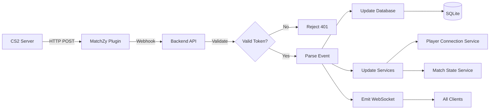

# Event Processing System

The system processes **25+ real-time MatchZy events** to provide live updates for tournaments, matches, and player tracking.

## Overview

All CS2 game server events are sent via HTTP POST webhooks from the MatchZy plugin to the backend API, which processes them and broadcasts updates via WebSocket to all connected clients.

## Event Categories

### Match Lifecycle Events

| Event | Description | Triggers |
|-------|-------------|----------|
| `series_start` | Match series begins | Match config loaded |
| `going_live` | Match goes live after warmup | Countdown complete |
| `round_start` | New round starts | Round begins |
| `round_end` | Round ends | Round complete |
| `side_picked` | Team picks starting side | Veto or knife decision |
| `map_result` | Map finished | Final round |
| `series_end` | Entire match series ends | All maps complete |

### Player Events

| Event | Description | Updates |
|-------|-------------|---------|
| `player_connect` | Player joins server | Connection count |
| `player_disconnect` | Player leaves server | Connection count |
| `player_ready` | Player readies in warmup | Ready status |
| `player_unready` | Player unreadies | Ready status |
| `player_death` | Player killed | Kill feed, stats |

### Team Events

| Event | Description | Result |
|-------|-------------|--------|
| `team_ready` | All 5 players ready | Team ready indicator |
| `all_players_ready` | Both teams ready (10/10) | Start countdown |
| `knife_won` | Team wins knife round | Side selection |

### Match Phase Events

| Event | Description | Phase Change |
|-------|-------------|--------------|
| `warmup_ended` | Warmup phase complete | → Live or Knife |
| `knife_round_started` | Knife round begins | → Knife phase |
| `knife_round_ended` | Knife round complete | → Side pick |
| `halftime_started` | Halftime reached (12 rounds) | → Break |
| `overtime_started` | Overtime begins | → OT rounds |

### Admin Action Events

| Event | Description | Action |
|-------|-------------|--------|
| `match_paused` | Admin/player pauses | Game frozen |
| `unpause_requested` | Player requests unpause | Waiting for both teams |
| `match_unpaused` | Match resumes | Game continues |
| `backup_loaded` | Round backup restored | Time travel |
| `veto_completed` | Map veto finished | Match ready |

### Demo Events

| Event | Description | Payload |
|-------|-------------|---------|
| `demo_upload_ended` | Demo file ready | File name, map number |

## Event Flow



## Webhook Configuration

### Automatic Setup

The system automatically configures webhooks when:

1. **Server status check** - Admin Tools → Check Status
2. **Match load** - Manual or automatic allocation
3. **Tournament start** - Batch configuration

### Manual Configuration

Add to your CS2 `server.cfg`:

```cfg
matchzy_remote_log_url "http://your-api-url:3000/api/events/r1m1"
matchzy_remote_log_header_key "X-MatchZy-Token"
matchzy_remote_log_header_value "your-server-token-here"
```

!!! important "URL Format"
    The webhook URL **must include the match slug**: `/api/events/{matchSlug}`
    
    This allows the system to associate events with the correct match even when MatchZy sends `matchid: -1`.

## Event Payload Structure

### Generic Event

```json
{
  "event": "event_name",
  "matchid": 1,
  "timestamp": 1762343270
}
```

### Player Event Example

```json
{
  "event": "player_connect",
  "matchid": 1,
  "player": {
    "steamid": "76561199486434142",
    "name": "Simpert",
    "team": "COUNTER-TERRORISTS"
  }
}
```

### Round Event Example

```json
{
  "event": "round_end",
  "matchid": 1,
  "map_number": 0,
  "round_number": 3,
  "reason": 7,
  "winner": {
    "side": "CT",
    "team": "team1"
  },
  "team1": {
    "score": 2,
    "score_t": 1,
    "score_ct": 1
  },
  "team2": {
    "score": 1,
    "score_t": 1,
    "score_ct": 0
  }
}
```

## Processing Logic

### Match ID Handling

The system prioritizes **match slug from URL** over `matchid` in payload:

```typescript
// Extract slug from URL path
const matchSlug = req.path.replace('/api/events/', '').split('/')[0];

// Use slug as source of truth
const match = db.findOne('matches', { slug: matchSlug });
```

This solves issues where MatchZy sends `matchid: -1` during:
- Server startup
- Match restarts
- Configuration reloads

### Database Storage

All events are stored in `match_events` table:

```sql
CREATE TABLE match_events (
  id INTEGER PRIMARY KEY,
  match_id INTEGER NOT NULL,
  event_type TEXT NOT NULL,
  event_data TEXT NOT NULL,
  created_at TEXT DEFAULT CURRENT_TIMESTAMP,
  FOREIGN KEY (match_id) REFERENCES matches(id)
);
```

### Foreign Key Protection

Events are only stored if the match exists:

```typescript
const match = db.findOne('matches', { slug: matchSlug });

if (match) {
  try {
    db.insert('match_events', {
      match_id: match.id,
      event_type: event.event,
      event_data: JSON.stringify(event)
    });
  } catch (error) {
    // Log but don't block MatchZy
    console.warn('Event storage failed:', error);
  }
}
```

## WebSocket Emissions

### Event Types

```typescript
// Match-specific updates
socket.emit('match:update', { matchSlug: 'r1m1' });

// Bracket updates
socket.emit('bracket:update', { tournamentId: 1 });

// Server-wide events (for monitoring)
socket.emit('server:event', { 
  serverId: 'ntlan_1',
  event: eventData 
});
```

### Client Subscription

```typescript
useEffect(() => {
  socket.on('match:update', ({ matchSlug }) => {
    if (matchSlug === currentMatch) {
      refetchMatchData();
    }
  });

  return () => socket.off('match:update');
}, [currentMatch]);
```

## Event Debugging

### Backend Console

Enable full event logging:

```bash
# Shows all incoming events
📡 FULL EVENT RECEIVED:
{
  "event": "player_connect",
  "player": { "steamid": "76561...", "name": "Simpert" }
}
---
🖥️ Server ID: ntlan_1 (from match slug in URL)
✅ Match found: r1m1 (ID: 5)
```

### API Endpoint

Test events manually:

```http
GET /api/events/test
```

**Response:**
```json
{
  "message": "Events endpoint is working",
  "timestamp": 1762343270
}
```

## Error Handling

### Missing Match

```
ℹ️ Event received but no match is loaded (matchid: -1)
   This is normal during server startup or between matches.
```

→ Event is processed for player tracking but not stored

### Invalid Token

```
❌ Invalid server token
```

→ Returns `401 Unauthorized`

### Database Constraint

```
⚠️ FOREIGN KEY constraint failed
   Match may not exist yet
```

→ Logs warning but continues (doesn't block MatchZy)

## Performance Considerations

### Event Rate

During a live match:
- **~2-5 events/second** normal gameplay
- **~10-20 events/second** during round end
- **100+ events** per full match

### Optimization

- Events are processed asynchronously
- Database writes are non-blocking
- WebSocket broadcasts are batched
- Old events auto-expire (configurable)

## Related Documentation

- [Player Tracking](player-tracking.md) - Connection status
- [WebSocket Events](../development/websockets.md) - Real-time updates
- [MatchZy Events](../matchzy/events.md) - Full event reference

