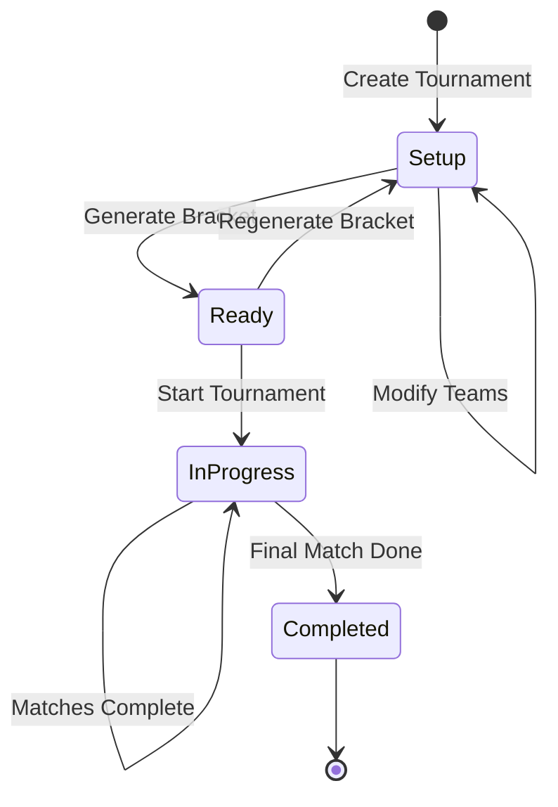

# Feature Overview

A comprehensive look at everything MatchZy Auto Tournament can do.

---

## Tournament Management

### Bracket Generation

**Supported Formats:**

| Format | Teams | Matches | Description |
|--------|-------|---------|-------------|
| Single Elimination | 2-128 | ~N | One loss = eliminated |
| Double Elimination | 2-128 | ~2N | Two losses = eliminated |
| Round Robin | 2-32 | N(N-1)/2 | Everyone plays everyone |
| Swiss | 4-64 | ~log₂(N) rounds | Similar records face off |

**Features:**

- ✅ Automatic bye handling for non-power-of-two team counts
- ✅ Smart seeding (random or manual)
- ✅ Walkover support (missing team advances opponent)
- ✅ Third-place match (optional)
- ✅ Bracket regeneration without losing tournament

### Tournament Lifecycle



**States:**

- **Setup:** Configuring tournament and teams
- **Ready:** Bracket generated, waiting to start
- **In Progress:** Tournament active, matches running
- **Completed:** All matches finished

---

## Match System

### Match Statuses

**Pending** → Match created but tournament not started  
**Ready** → Tournament started, waiting for veto or server  
**Loaded** → On server, warmup mode, players connecting  
**Live** → Match in progress, rounds being played  
**Completed** → Winner determined, bracket updated

### Intelligent Match Status Messages

The system shows context-aware status messages:

| Status | Condition | Message |
|--------|-----------|---------|
| Pending | Tournament not started | "Waiting for tournament to start..." |
| Ready | Veto not complete | "Teams voting for maps..." |
| Ready | Veto complete | "Veto complete - Waiting for server..." |
| Loaded | 0 players | "Server ready - Waiting for players (0/10)" |
| Loaded | Some players | "Waiting for players (3/10)" |
| Loaded | All players | "All players connected - Waiting for ready up" |
| Live | - | "Match in progress" |

---

## Real-Time Features

### WebSocket Events

**Frontend automatically updates when:**

- 🔄 Match status changes (pending → ready → loaded → live → completed)
- 🔄 Players connect/disconnect
- 🔄 Players ready/unready  
- 🔄 Veto actions happen (ban, pick, side selection)
- 🔄 Tournament state changes (starts, completes)
- 🔄 Bracket updates (winners determined)

**No page refresh required!**

### Player Connection Tracking

Shows **live roster** of all 10 players with status:

- ✅ **Offline** — Player not connected (gray)
- ⚠️ **Connected** — Player joined, not ready (yellow)
- ✅ **Ready** — Player typed `.ready` (green)

**Tracked via events:**
- `player_connect` → Add to roster
- `player_disconnect` → Remove from roster
- `player_ready` → Mark as ready
- `player_unready` → Mark as not ready

---

## Server Management

### Auto Server Allocation

When tournament starts or veto completes:

1. System finds available servers (online + not in use)
2. Allocates server to match
3. Generates match config with teams and maps
4. Sends RCON: `matchzy_loadmatch_url "http://api/matches/{slug}.json"`
5. Configures webhook: `matchzy_remote_log_url "http://api/events/{slug}"`
6. Configures demo upload
7. Match goes to warmup

**All automatic!**

### Server Status Monitoring

- **RCON Heartbeat:** Periodic status checks
- **Match Tracking:** Which match is on which server
- **Auto-Config:** Webhook configured on status check
- **Health Indicators:** Online/offline status with colors

---

## Event Processing

### 25+ MatchZy Events Processed

**Player Events:**
- `player_connect`, `player_disconnect`
- `player_ready`, `player_unready`
- `player_death`, `round_mvp`

**Match Phase Events:**
- `series_start`, `series_end`
- `going_live`, `warmup_ended`
- `knife_round_started`, `knife_round_ended`
- `halftime_started`, `overtime_started`

**Round Events:**
- `round_started`, `round_end`
- `bomb_planted`, `bomb_defused`, `bomb_exploded`

**Pause Events:**
- `match_paused`, `unpause_requested`, `match_unpaused`

**Admin Events:**
- `side_swap`, `backup_loaded`

**All events:**
- ✅ Logged to console
- ✅ Stored in database (`match_events` table)
- ✅ Logged to files (`data/logs/events/`)
- ✅ Broadcast via WebSocket
- ✅ Trigger appropriate service updates

---

## Admin Controls

### Live Match Controls

**Available during warmup/live:**

- ▶️ Start match (force start)
- 🔄 Restart match
- ⏸️ Pause match (admin pause - players can't unpause)
- ▶️ Unpause match
- 💬 Broadcast message
- 🔄 Restore backup (specific round)
- 🗺️ Change map
- 🔀 Swap teams
- ⏭️ Skip veto
- 🔪 Toggle knife round
- ⏱️ Add time
- 🏁 End match
- 👥 **Add backup player** (new!)

### Backup Player System

**How it works:**

1. Admin opens match modal
2. Scrolls to "Add Backup Player"
3. Types player name in autocomplete search
4. Selects player from dropdown (shows all tournament players)
5. Chooses target team (Team 1 or Team 2)
6. Clicks "Add Player to Match"

**Backend sends RCON:**
```
get5_addplayer {steamId} {team} "{nickname}"
```

**Features:**

- ✅ Searches across all teams in tournament
- ✅ Filters out players already in match
- ✅ Shows player's original team
- ✅ Real-time autocomplete
- ✅ Requires player to reconnect after adding

---

## Demo Recording

### Automatic Demo Upload

MatchZy automatically uploads demos when matches complete:

**Backend endpoint:** `POST /api/demos/{matchSlug}/upload`

**Features:**

- ✅ Streaming upload (doesn't load entire file into memory)
- ✅ Match-specific folders (`demos/{matchSlug}/`)
- ✅ Original filename preserved
- ✅ Metadata from headers (map number, match ID)

### Demo Download

Admins can download demos from:

- Match Details modal
- Match History page
- API: `GET /api/demos/{matchSlug}/download`

---

## Team Experience

### Public Team Pages

**URL Format:** `/team/{team-id}/match`

**No login required** — teams access via shared link

**Features:**

- 🎮 Current match info (opponent, round, status)
- 🗺️ Map veto interface (BO1/BO3/BO5)
- 🖥️ Server connection details (IP, port, connect command)
- 📊 Live player status (who's connected, who's ready)
- 📈 Team statistics (wins, losses, win rate)
- 📜 Match history (past opponents and scores)
- 🔊 Sound notifications (customizable)

### Sound Notifications

**8 Available Sounds:**
- Notification (default)
- Alert
- Bell
- Chime
- Ding
- Ping
- Pop
- Success

**Controls:**
- 🔊 Volume slider
- 🔇 Mute toggle
- 🎵 Sound preview
- 💾 Persists per browser

**Plays when:** Match status changes to "loaded" or "live"

---

## Monitoring & Debugging

### Server Events Monitor

**Admin Tools → Server Events Monitor**

Shows **unfiltered stream** of all MatchZy events from all servers:

- ✅ Last 100 events buffered
- ✅ Real-time WebSocket updates
- ✅ Color-coded by event type
- ✅ Full JSON payload display
- ✅ Pause/resume streaming
- ✅ Server filter (optional)

**Perfect for debugging:**
- Verify events are being sent
- Check player Steam IDs
- Monitor match progression
- Identify configuration issues

### Event File Logging

All events logged to: `data/logs/events/{serverId}/{date}.log`

**Retention:** 30 days  
**Format:** JSON lines  
**Use case:** Historical analysis, debugging, recovery

---

## Next Steps

- 🎮 **[Player Tracking Details](player-tracking.md)** — How player status works
- 📡 **[Event Processing Deep Dive](events.md)** — All event types explained
- 🎛️ **[Admin Controls Reference](admin-controls.md)** — Complete command list

