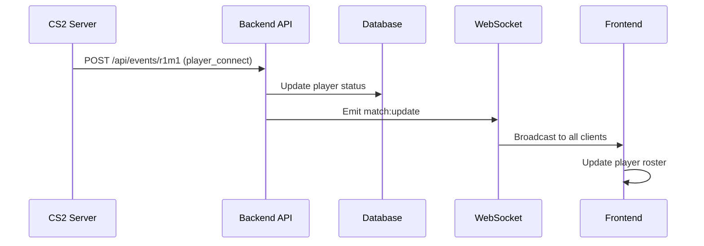

# Player Connection & Ready Status Tracking

The system provides comprehensive real-time tracking of player connections and ready status throughout the match lifecycle.

## Overview

Every player interaction with the CS2 server is tracked in real-time through MatchZy events, allowing administrators and teams to monitor:

- **Connection Status**: Who is connected to the server
- **Ready Status**: Who has readied up in warmup
- **Team Assignment**: Which team each player belongs to
- **Live Updates**: Real-time updates via WebSocket

## Features

### Real-time Player Roster

The player roster displays on:

- **Match Details Modal** (admin view)
- **Team Match Pages** (team view)

Each player entry shows:

```
✓ Simpert          [TEAM PING]  Connected • Ready
✗ PlayerName       [TEAM SIMP]  Not Connected
```

### Connection Events

The system processes these MatchZy events:

- `player_connect` - Player joins the server
- `player_disconnect` - Player leaves the server
- `player_ready` - Player readies up in warmup
- `player_unready` - Player unreadies
- `team_ready` - Entire team is ready (5/5)
- `all_players_ready` - Both teams ready (10/10)

### Progress Indicators

Visual feedback throughout the UI:

- **"Waiting for players (3/10)"** - Connection count
- **"All players connected, waiting for ready"** - Next phase
- **Linear progress bar** - Visual representation

## How It Works

### Backend Flow



### Team Assignment

Players are matched to teams using:

1. **Steam ID lookup** from match configuration
2. **Team field** from MatchZy event (`TERRORIST` / `COUNTER-TERRORIST`)
3. **Database records** for player-team associations

### Data Structure

```typescript
interface ConnectedPlayer {
  steamId: string;
  name: string;
  team: 'team1' | 'team2';
  isReady: boolean;
}

interface ConnectionStatus {
  connectedPlayers: ConnectedPlayer[];
  expectedPlayers: number;
  team1Connected: number;
  team2Connected: number;
  team1Ready: number;
  team2Ready: number;
}
```

## API Endpoints

### Get Connection Status

```http
GET /api/events/connections/:matchSlug
```

**Response:**
```json
{
  "connectedPlayers": [
    {
      "steamId": "76561199486434142",
      "name": "Simpert",
      "team": "team1",
      "isReady": true
    }
  ],
  "expectedPlayers": 10,
  "team1Connected": 3,
  "team2Connected": 2,
  "team1Ready": 3,
  "team2Ready": 1
}
```

!!! note "Public Endpoint"
    This endpoint is **public** (no authentication required) so team pages can access it.

## Integration in UI

### Match Details Modal

```tsx
<PlayerRoster 
  matchSlug="r1m1"
  team1Name="Pinger"
  team2Name="Simper"
/>
```

### Team Match Page

```tsx
{match.status === 'loaded' && (
  <PlayerRoster 
    matchSlug={match.slug}
    team1Name={match.team1?.name}
    team2Name={match.team2?.name}
  />
)}
```

## Debugging

If player connections aren't updating:

1. **Check event logs** in backend console
2. **Verify match slug** is correct in webhook URL
3. **Ensure `get5_check_auths true`** is set (prevents random joins)
4. **Check browser console** for WebSocket connection

```bash
# Backend logs should show:
📡 Event received: player_connect
   Match: r1m1
   Player: Simpert (76561199486434142)
   Team: team1
```

## Whitelist Protection

To prevent random players from joining:

```cfg
# Automatically set when match loads
get5_check_auths true
```

This ensures only players listed in the match configuration can connect.

## Related Features

- [Event Processing](events.md) - All MatchZy events
- [Admin Controls](admin-controls.md) - Managing players mid-match
- [Team Pages](../guides/team-pages.md) - Public team interface

