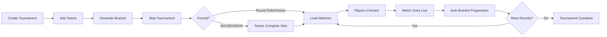

# MatchZy Auto Tournament

  
  
  **Automated tournament management system for CS2 MatchZy**
  
  _Stop manually configuring servers. Load matches, track events, and manage entire tournaments through one API._

---

## What is MatchZy Auto Tournament?

MatchZy Auto Tournament is a complete tournament automation system for Counter-Strike 2, built specifically to work with the [MatchZy plugin](https://github.com/shobhit-pathak/MatchZy). It handles everything from bracket generation to live match monitoring, with zero manual server configuration.

## Key Highlights

### 🚀 One-Click Tournament Management
Create a tournament, add teams, click "Start" — matches automatically load on your server fleet with proper configurations.

### 🗺️ Professional Map Veto
Teams use an interactive web interface to ban and pick maps (FaceIT-style), with real-time synchronization and turn-based security.

### 📡 Real-Time Everything
WebSocket-powered live updates for player connections, match status, veto progress, and bracket advancement.

### 🎮 Team Experience
Public team pages (no login required) show server info, connection instructions, match history, and stats — shareable via simple links.

### 🛡️ Production-Ready
Docker deployment, automatic demo recording, comprehensive event logging, and secure RCON communication.

---

## Quick Links

- **[Quick Start Guide](getting-started/quick-start.md)** — Get running in 5 minutes
- **[Feature Overview](features/overview.md)** — See everything it can do
- **[API Reference](api/overview.md)** — Complete API documentation
- **[GitHub Repository](https://github.com/yourusername/matchzy-auto-tournament)** — Source code and issues

---

## Tournament Flow

---

## Supported Tournament Formats

| Format | Description | Min Teams | Max Teams | Uses Veto |
|--------|-------------|-----------|-----------|-----------|
| **Single Elimination** | One loss and you're out | 2 | 128 | ✅ (BO1/3/5) |
| **Double Elimination** | Two losses to be eliminated | 2 | 128 | ✅ (BO1/3/5) |
| **Round Robin** | Everyone plays everyone | 2 | 32 | ❌ |
| **Swiss System** | Similar records face each other | 4 | 64 | ❌ |

---

## What Makes It Different?

### vs. Manual MatchZy Configuration
- ❌ **Manual:** Create JSON configs, upload to server, run RCON commands for each match
- ✅ **Auto Tournament:** Click "Start Tournament" and it handles everything

### vs. Other Tournament Systems
- ✅ **Built for MatchZy** — Native integration with all events and commands
- ✅ **Real-time player tracking** — See exactly who's connected and ready
- ✅ **Team-centric UX** — Public pages teams can access without admin login
- ✅ **Map veto included** — Professional pick/ban system built-in

---

## Screenshots

  
  
<em>Interactive bracket with pan/zoom and live match status</em>

  
  
  
<em>FaceIT-style map veto with real-time team synchronization</em>

  
  
  
<em>Live player connection and ready status tracking</em>

---

## Community & Support

- 📖 **Documentation:** You're reading it!
- 🐛 **Bug Reports:** [GitHub Issues](https://github.com/yourusername/matchzy-auto-tournament/issues)
- 💡 **Feature Requests:** [GitHub Discussions](https://github.com/yourusername/matchzy-auto-tournament/discussions)
- 🤝 **Contributing:** [Contributing Guide](development/contributing.md)

---

  <strong>Made with ❤️ for the CS2 community</strong>

