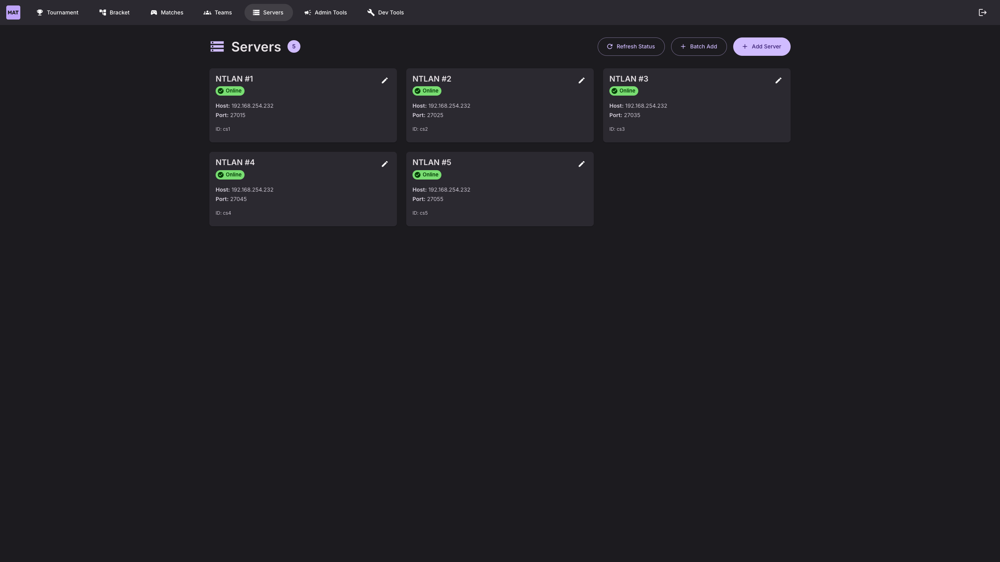
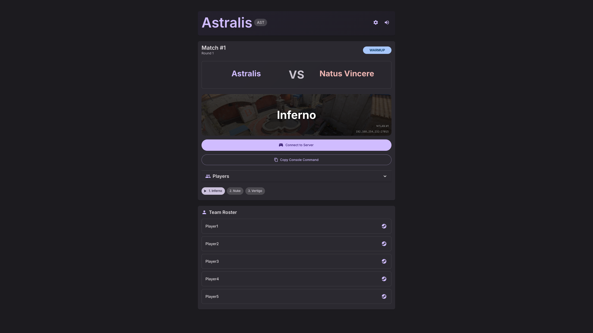
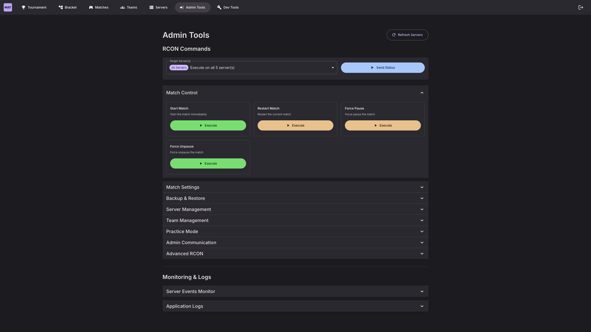

# Screenshots

Take a tour of MatchZy Auto Tournament's interface. Click any image to view in full size.

---

## Dashboard

Get started quickly with the onboarding checklist and quick access cards.

---

## Tournament Setup

### Create Tournament

Configure your tournament with name, teams, maps, and format in a simple step-by-step form.

### Complete Setup

Fill in all details including 8 teams and 7 maps for the competitive pool.

### Review & Confirm

Review all settings before starting your tournament.

---

## Team Management

Manage all your teams in one place. Create, edit, and view team rosters with player details.

---

## Server Management

Configure and monitor your CS2 servers with real-time status indicators.

---

## Tournament Bracket

Visual bracket view showing Quarter-Finals, Semi-Finals, and Finals with team matchups.

---

## Match Management

Overview of all matches with live status updates and match cards.

---

## Public Team Pages

### Map Veto Interface

Interactive FaceIT-style map veto for teams with all competitive maps.

### Match Information

Teams can view match details, server connection info, and player rosters.

---

## Admin Tools

Powerful RCON commands and match controls for tournament administrators.

---

## Key Features Shown

✅ **Onboarding System** - Step-by-step getting started guide  
✅ **Tournament Creation** - Multi-step form with validation  
✅ **Team Management** - Full roster management with team tags  
✅ **Server Management** - Real-time server status monitoring  
✅ **Visual Brackets** - Clean, modern bracket visualization  
✅ **Match Management** - Live match tracking and status updates  
✅ **Map Veto** - Interactive pick/ban system with map previews  
✅ **Public Team Pages** - No-auth pages for team access  
✅ **Admin Controls** - Comprehensive RCON command interface  

---

**Ready to get started?**

[Quick Start Guide](getting-started/quick-start.md){ .md-button .md-button--primary }
[View Features](features/overview.md){ .md-button }

